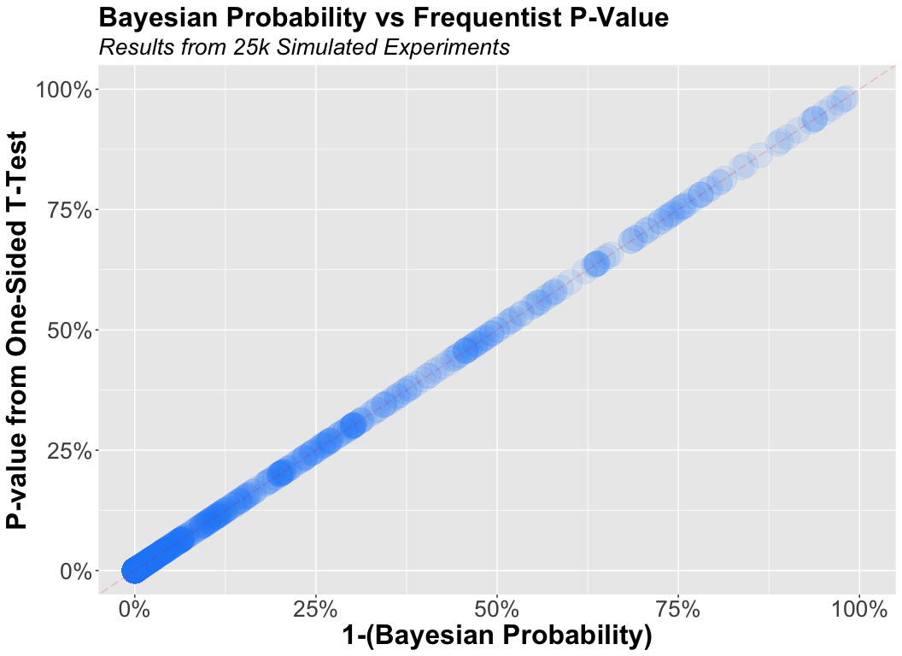

Bayesian vs Frequentist Inference: Simulation-Based Comparison
================
Josh Hanson, Eppo Customer Data Scientist

## Objective

<<<<<<< Updated upstream
In this notebook, I aim to utilize a simulation-based approach to
illustrate that a Bayesian Inference model will always result in the
same decision as a Frequentist Inference model when the Bayesian
Inference model utilizes uninformative priors. 
=======
In this notebook, I utilize a simulation-based approach to illustrate
that a Bayesian Inference model will always result in the same decision
as a Frequentist Inference model when the Bayesian Inference model
utilizes uninformative priors.  
>>>>>>> Stashed changes

I do this by running 25k, simulated, random experiments. For each
simulated experiment, I record:

1.  The observed Frequentist p-value resulting from a one-sided,
    t-test  
2.  The calculated Bayesian probability that the variant is at least as
    good as the control  

I then use the results of these simulations to visually compare the two
inferential statistics and find that the relationship is perfectly
predictive. We then validate this visual observation by building a
simple linear-model that predicts an experiment’s Bayesian Probability
using an experiment’s Frequentist P-Value.  

## Simulation Explanation

For each simulated experiment, I take a random number between 5k and
10k. That random number determines the sample size in each variant.  

I then take a random draw from a uniform distribution between the values
of 0.1 and 0.9. This random number serves as the observed conversion
rate for a hypothetical control group. I then take another random draw
from a uniform distribution between the values of 0 and 0.1. This random
number serves as our hypothetical, relative percent increase observed
for the experiment group.  

From this random draw of values, I calculate both a Frequentist P-Value
from a one-sided T-Test and the analogous Bayesian inferential
statistic, the probability that the Variant is at least as good as the
Control.

If curious, immediately below, you can see the code I’ve used to run
this simulation.

``` r
set.seed(1431)

n_simulations <- 25000
prob_results <- numeric(n_simulations)
pvalue_results <- numeric(n_simulations)

## run loop, essentially simulation n random experiments
for (i in 1:n_simulations){

  sample_size <- sample(5000:10000,1)

  cvr1 <- runif(1,min=.1,max=.9) ## take a random number from a uniform distribution with a min of 0.1 and a max of 0.9 to serve as the baseline conversion rate for the control group
  cvr2 <- cvr1*(1+runif(1,.0001,.1)) ## take a random number from a uniform distribution with a min of 0 and a max of .1 to serve as the observed relative percent increase in the conversion rate

  df1 <- data.frame(value=rbinom(sample_size,1,cvr1)) ## generate a random sample from a binomial distribution with a sample size and mean value equal to the random draws above
  df2 <- data.frame(value=rbinom(sample_size,1,cvr2))

  model <- calcInference(df1,df2) ## generate statistical inferences on the sample data

  prob_results[i] <- model[[1]] ## save bayesian probability
  pvalue_results[i] <- model[[2]] ## save frequentist pvalue

}
sim_results <- data.frame(probs = prob_results, pvalue = pvalue_results)
```

## Simulation Results

------------------------------------------------------------------------

A scatter plot of our two values of interest implies a perfect linear
relationship.  

------------------------------------------------------------------------

``` r
sim_results %>% sample_n(1000,replace=FALSE) %>% ggplot(aes(x=1-probs,y=pvalue)) +
  ggtitle('Bayesian Probability vs Frequentist P-Value',subtitle='Results from 25k Simulated Experiments') +
  geom_jitter(size=10,alpha=.1,colour='#F8C630') +
  scale_y_continuous(labels = scales::percent) +
  scale_x_continuous(labels = scales::percent) +
  coord_cartesian(xlim=c(0,1),ylim=c(0,1)) +
  geom_abline(slope=1,linetype='longdash',colour='red',alpha=0.2) +
  xlab('1-(Bayesian Probability)') +
  ylab('P-value from One-Sided T-Test') +
  theme(plot.title = element_text(face = "bold",size=24,family='AkkuratLL-Bold')) +
  theme(axis.text=element_text(size=20),
        axis.title=element_text(size=24,face="bold"),
        plot.subtitle=element_text(size=20,face="italic", color="black")) +
  theme(panel.background = element_rect(fill = "#752570", colour = "#752570",size = 0.5))  +
  theme(text=element_text(family="AkkuratLL-Regular"))
```

<!-- -->

------------------------------------------------------------------------

A simple linear model predicting a Bayesian probability using a T-test
p-value validates our inference from the scatter plot. A perfectly
predictive relationship exists between these two inference methods.  

------------------------------------------------------------------------

``` r
## As expected, a simple linear model implies that a Bayesian probability is perfectly predicted of a frequentist p-value.
model <- lm(probs ~ pvalue,data=sim_results)
summary(model)
```

    ## 
    ## Call:
    ## lm(formula = probs ~ pvalue, data = sim_results)
    ## 
    ## Residuals:
    ##        Min         1Q     Median         3Q        Max 
    ## -1.537e-03 -2.097e-05 -2.760e-06  2.071e-05  2.060e-03 
    ## 
    ## Coefficients:
    ##               Estimate Std. Error t value Pr(>|t|)    
    ## (Intercept)  1.000e+00  1.636e-06  611111   <2e-16 ***
    ## pvalue      -1.000e+00  7.012e-06 -142620   <2e-16 ***
    ## ---
    ## Signif. codes:  0 '***' 0.001 '**' 0.01 '*' 0.05 '.' 0.1 ' ' 1
    ## 
    ## Residual standard error: 0.0002298 on 24998 degrees of freedom
    ## Multiple R-squared:      1,  Adjusted R-squared:      1 
    ## F-statistic: 2.034e+10 on 1 and 24998 DF,  p-value: < 2.2e-16
